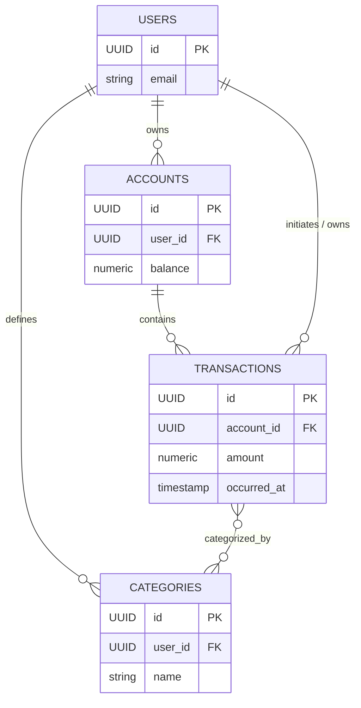

# Database schema — Personal Finance Tracker

This document describes the core database schema for the Personal Finance Tracker backend. It lists the main entities (tables), their key columns, relationships, example SQL DDL, and a Mermaid ER diagram for a quick visual overview.

## Overview

- Purpose: track users, their accounts, and transactions (with categories/tags).  
- Primary store: relational database (PostgreSQL recommended).  
- Conventions: UUID primary keys, `created_at`/`updated_at` audit timestamps, soft-delete where noted.

## Entities

- **users**
  - id: UUID PK
  - email: varchar, unique, not null
  - password_hash: varchar, not null
  - name: varchar
  - created_at: timestamp default now()
  - updated_at: timestamp

- **accounts**
  - id: UUID PK
  - user_id: UUID FK -> users.id (ON DELETE CASCADE)
  - name: varchar, not null
  - currency: varchar(3) default 'USD'
  - balance: numeric(14,2) default 0
  - created_at, updated_at

- **transactions**
  - id: UUID PK
  - account_id: UUID FK -> accounts.id (ON DELETE CASCADE)
  - user_id: UUID FK -> users.id (denormalized for quick access)
  - amount: numeric(14,2) not null (positive for credit, negative for debit) — or use `type` with absolute amount
  - currency: varchar(3)
  - description: text
  - occurred_at: timestamp not null
  - is_recurring: boolean default false
  - is_deleted: boolean default false (soft-delete)
  - created_at, updated_at

- **categories**
  - id: UUID PK
  - user_id: UUID FK -> users.id (user-specific categories)
  - name: varchar not null
  - type: varchar (e.g., 'expense'|'income'|'transfer')
  - created_at, updated_at

- **transaction_categories** (join table for many-to-many between transactions and categories)
  - transaction_id: UUID FK -> transactions.id
  - category_id: UUID FK -> categories.id
  - PRIMARY KEY (transaction_id, category_id)

## Keys, constraints, and indexes

- Primary keys: UUIDs on `id` columns.  
- Foreign keys: `accounts.user_id -> users.id`; `transactions.account_id -> accounts.id`; `categories.user_id -> users.id`.  
- Indexes:
  - `transactions(account_id)`
  - `transactions(user_id, occurred_at)` for querying user history by date
  - `accounts(user_id)` for listing accounts per user
  - unique constraint on `users(email)`

## Example SQL DDL (Postgres)

```sql
CREATE EXTENSION IF NOT EXISTS "uuid-ossp";

CREATE TABLE users (
  id UUID PRIMARY KEY DEFAULT uuid_generate_v4(),
  email VARCHAR(255) UNIQUE NOT NULL,
  password_hash VARCHAR(255) NOT NULL,
  name VARCHAR(255),
  created_at TIMESTAMP WITH TIME ZONE DEFAULT now(),
  updated_at TIMESTAMP WITH TIME ZONE
);

CREATE TABLE accounts (
  id UUID PRIMARY KEY DEFAULT uuid_generate_v4(),
  user_id UUID NOT NULL REFERENCES users(id) ON DELETE CASCADE,
  name VARCHAR(255) NOT NULL,
  currency VARCHAR(3) NOT NULL DEFAULT 'USD',
  balance NUMERIC(14,2) NOT NULL DEFAULT 0,
  created_at TIMESTAMP WITH TIME ZONE DEFAULT now(),
  updated_at TIMESTAMP WITH TIME ZONE
);

CREATE TABLE transactions (
  id UUID PRIMARY KEY DEFAULT uuid_generate_v4(),
  account_id UUID NOT NULL REFERENCES accounts(id) ON DELETE CASCADE,
  user_id UUID NOT NULL REFERENCES users(id),
  amount NUMERIC(14,2) NOT NULL,
  currency VARCHAR(3),
  description TEXT,
  occurred_at TIMESTAMP WITH TIME ZONE NOT NULL,
  is_recurring BOOLEAN DEFAULT FALSE,
  is_deleted BOOLEAN DEFAULT FALSE,
  created_at TIMESTAMP WITH TIME ZONE DEFAULT now(),
  updated_at TIMESTAMP WITH TIME ZONE
);

CREATE TABLE categories (
  id UUID PRIMARY KEY DEFAULT uuid_generate_v4(),
  user_id UUID NOT NULL REFERENCES users(id) ON DELETE CASCADE,
  name VARCHAR(255) NOT NULL,
  type VARCHAR(32),
  created_at TIMESTAMP WITH TIME ZONE DEFAULT now(),
  updated_at TIMESTAMP WITH TIME ZONE
);

CREATE TABLE transaction_categories (
  transaction_id UUID NOT NULL REFERENCES transactions(id) ON DELETE CASCADE,
  category_id UUID NOT NULL REFERENCES categories(id) ON DELETE CASCADE,
  PRIMARY KEY (transaction_id, category_id)
);

CREATE INDEX idx_transactions_account_id ON transactions(account_id);
CREATE INDEX idx_transactions_user_date ON transactions(user_id, occurred_at);
CREATE INDEX idx_accounts_user ON accounts(user_id);
```

## ER diagram (Mermaid)



## Notes & conventions

- Use UUIDs for distributed uniqueness and easier migrations.  
- Store amounts as `NUMERIC` with fixed precision to avoid floating point rounding.  
- Soft-delete transactions with `is_deleted` instead of hard delete where audit/history is important.  
- Denormalize `user_id` on `transactions` for faster user-centric querying.  
- Add migration files matching your project's migration tooling (e.g., `backend/migrations/`) using the DDL above.

If you prefer a different ORM (Prisma/TypeORM/Sequelize) schema instead of raw SQL, tell me which one and I will add the ORM schema file as well.

